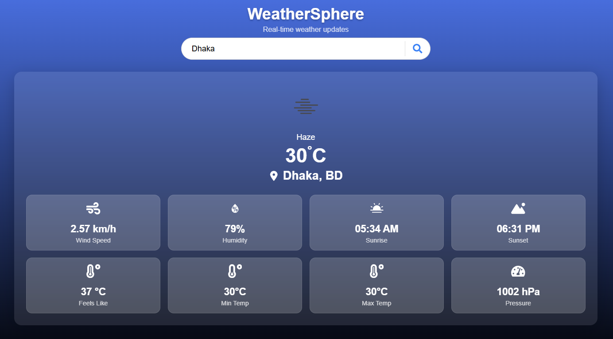

# WeatherSphere 🌦️

A modern weather application built with React, Vite, and OpenWeatherMap API that displays real-time weather data with beautiful animations.

## Features ✨

- Real-time weather data for any city worldwide
- Beautiful animated UI with AOS (Animate On Scroll)
- Responsive design that works on all devices
- Detailed weather metrics including:
  - Temperature (current, feels like, min/max)
  - Humidity
  - Wind speed
  - Atmospheric pressure
  - Sunrise/sunset times

## Technologies Used 🛠️

- React 19
- Vite (for ultra-fast development)
- React Icons
- AOS (Animate On Scroll)
- OpenWeatherMap API
- CSS