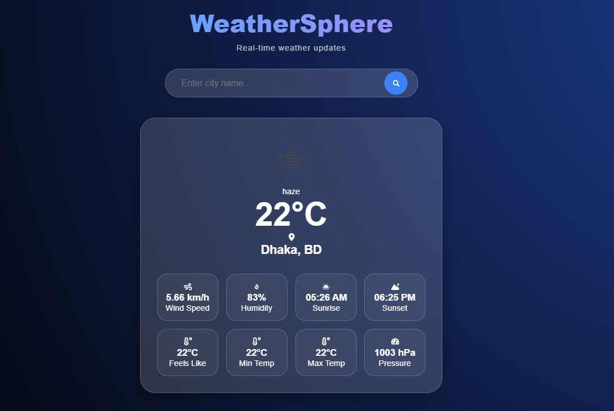

<div align="center">


# WeatherSphere 🌦️

**A modern, intuitive, and responsive weather forecasting application.**  
WeatherSphere provides real-time meteorological data with a sleek, animated user experience.

<br>

<!-- Preview Image -->


<br>

<!-- Live Demo -->
<a href="https://weather-app-virid-omega.vercel.app">
  
</a>

<br><br>

<!-- Tech Badges -->
<p>
  
  
  
  
</p>

</div>

---

## 🌟 Key Features

*   **Global Coverage:** Get real-time weather updates for any city worldwide.
*   **Immersive Design:** Beautiful, fluid animations powered by AOS (Animate On Scroll).
*   **Comprehensive Metrics:** 
    *   🌡️ Precise temperature (Current, Feels Like, Min/Max)
    *   💧 Humidity & Atmospheric Pressure
    *   💨 Wind Speed & Direction
    *   🌅 Sunrise & Sunset tracking
*   **Fully Responsive:** Optimized performance across all desktop, tablet, and mobile devices.

---

## 🛠️ Tech Stack

*   **Frontend:** React 19, Vite
*   **Styling:** Modern CSS3
*   **Animations:** AOS (Animate On Scroll)
*   **Icons:** React Icons
*   **API:** [OpenWeatherMap API](https://openweathermap.org/api)

---

## 🚀 Getting Started

### Prerequisites
Make sure you have [Node.js](https://nodejs.org/) and a package manager (npm, yarn, pnpm) installed.

### Installation

1. **Clone the repository**
   ```bash
   git clone https://github.com/tuhin360/weather-app.git
   cd weather-app
   ```

2. **Install dependencies**
   ```bash
   npm install
   # or
   pnpm install
   ```

3. **Set up API Key**
   Create a `.env` file in the root directory and add your OpenWeatherMap API Key:
   ```env
   VITE_API_KEY=your_openweathermap_api_key_here
   ```

4. **Start the development server**
   ```bash
   npm run dev
   ```

---

## 💡 How to Use
1. Enter the name of the city in the search bar.
2. Hit Enter or click the search icon.
3. Enjoy your real-time weather dashboard!

---

## 👨‍💻 Author

**Jahedi Alam Tuhin**  
GitHub: [@tuhin360](https://github.com/tuhin360)

---

## ⭐ Support
If you enjoy this project, please consider giving it a ⭐ on GitHub!